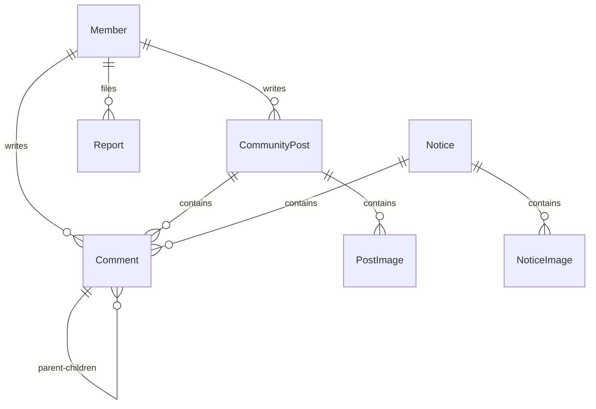

# Y-Sync Technical Architecture

Y-Sync 프로젝트의 기술 스택, 백엔드 및 프론트엔드 시스템 아키텍처, 패키지 구조, 그리고 핵심 엔티티 관계를 기술한 가이드 문서입니다.

---

## 1. 기술 스택 (Technology Stack)

### 백엔드 (Backend)
* **Framework**: Spring Boot 3.x
* **Security**: Spring Security (JWT Stateless Auth)
* **Database / ORM**: Spring Data JPA, H2 Database (개발) / MySQL (운영)
* **Build Tool**: Gradle (Java 17)

### 프론트엔드 (Frontend)
* **Framework**: Flutter (Multi-platform: Web & Mobile)
* **State Management**: Flutter Riverpod 3.x (Notifier & FutureProvider 기반)
* **Network Client**: Dio (Interceptors를 통한 JWT 헤더 삽입 및 로깅 자동화)
* **Build Tool**: Flutter Web Builder (Release Minification 대응)

---

## 2. 백엔드 아키텍처 & 패키지 구조

Spring Boot MVC 패턴과 레이어드 아키텍처(Layered Architecture)를 따릅니다.

```
y-sync/backend/src/main/java/com/ync/ysync/
├── config/             # Security 설정, JWT 필터 및 유틸
│   ├── SecurityConfig.java
│   ├── JwtAuthenticationFilter.java
│   └── AuthUtil.java
├── controller/         # REST API 컨트롤러 레이어
│   ├── AdminController.java
│   ├── AdminMemberController.java
│   ├── CommentController.java
│   └── CommunityController.java
├── service/            # 비즈니스 로직 처리 레이어
│   ├── MemberService.java
│   ├── CommentService.java
│   └── EmailService.java
├── domain/             # JPA 엔티티 레이어
│   ├── Member.java
│   ├── CommunityPost.java
│   ├── Comment.java
│   ├── Report.java
│   └── Notice.java
└── repository/         # DB Access 인터페이스 레이어 (Spring Data JPA)
    ├── MemberRepository.java
    ├── CommentRepository.java
    ├── CommunityPostRepository.java
    └── ReportRepository.java
```

---

## 3. 프론트엔드 아키텍처 & 폴더 구조

MVVM 및 Provider 패턴 기반의 구조로 화면(View)과 상태(ViewModel)가 단방향 데이터 흐름으로 엄격히 분리되어 있습니다.

```
y-sync/frontend/lib/
├── models/             # API 수신 데이터를 매핑하는 불변 DTO 모델군
│   ├── member.dart
│   ├── comment.dart
│   ├── community_post.dart
│   └── notice.dart
├── providers/          # Riverpod 3.x 상태 관리 노티파이어 및 데이터 제공자
│   ├── auth_provider.dart
│   ├── comment_provider.dart
│   ├── community_provider.dart
│   └── admin_provider.dart
├── screens/            # UI 화면 컴포넌트군 (모바일 및 웹 겸용 반응형)
│   ├── admin_post_management_screen.dart
│   ├── community_detail_screen.dart
│   ├── notice_detail_screen.dart
│   └── login_screen.dart
├── widgets/            # 재사용성이 높은 디자인 위젯 및 커스텀 다이얼로그
│   ├── deletion_reason_dialog.dart
│   └── image_viewer_screen.dart
└── utils/              # 환경 의존적 추상화 유틸 및 헬퍼
    ├── csv_picker_stub.dart
    ├── csv_picker_web.dart
    └── image_url_helper.dart
```

---

## 4. 데이터 관계 요약 (JPA Entity Relationships)



* **대댓글 (자기 참조)**
  - `Comment` 엔티티 내에 `@ManyToOne Comment parent` 및 `@OneToMany List<Comment> children` 양방향 관계가 성립되어 계층적 관계를 저장합니다.
* **신고 (Report)**
  - `Report` 엔티티는 `@Enumerated(EnumType.STRING) TargetType targetType` (POST / COMMENT) 및 `Long targetId`를 결합하여 하나의 테이블에서 게시글과 댓글 신고를 다형성 형태로 유연하게 커버합니다.
* **소프트 딜리트 (Soft Delete)**
  - `CommunityPost` and `Comment` 엔티티는 `isDeleted` 플래그 및 `deletionReason` 문자열 필드를 통해 관리자에 의한 물리 삭제 대신 안전한 논리 삭제(블라인드)를 지원합니다.
