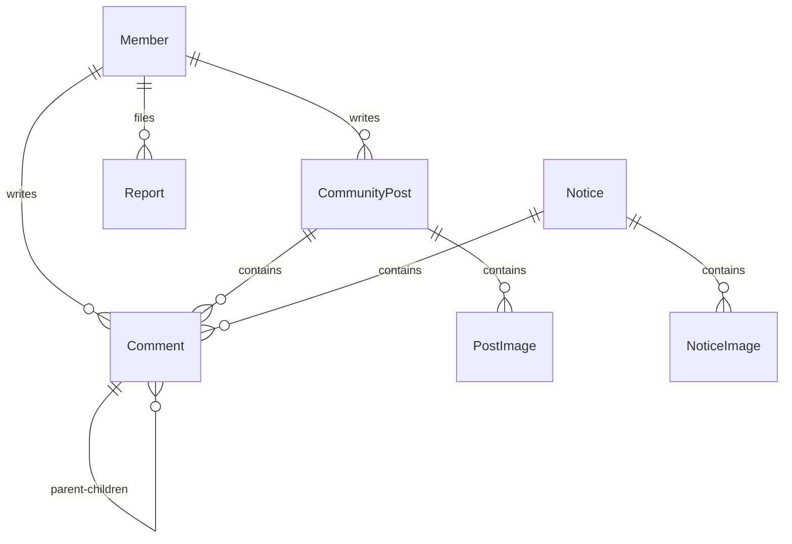

# Y-Sync Technical Architecture & Infrastructure Specifications

이 문서는 Y-Sync 프로젝트의 기술 스택, 시스템 아키텍처, 패키지 폴더 구조, 데이터 모델링(ERD), 로컬 개발/테스트용 시드 데이터 가이드, 그리고 Oracle Cloud 기반의 실서버 인프라 배포 스펙을 하나로 융합한 핵심 아키텍처 명세서입니다.

---

## 1. 기술 스택 요약 (Technology Stack)

### 백엔드 (Backend)
* **Framework**: Spring Boot 4.0.3 (Java 21)
* **Security**: Spring Security (JWT Stateless Authentication)
* **Database / ORM**: H2 Database (개발/테스트) / MySQL (프로덕션), Spring Data JPA
* **Build Tool**: Gradle

### 프론트엔드 (Frontend)
* **Framework**: Flutter (Web & Mobile Multi-platform 지원)
* **State Management**: Flutter Riverpod 3.x (Notifier, FutureProvider 기반)
* **Network Client**: Dio (Interceptors를 이용한 JWT 헤더 및 로깅 공통화)
* **Build Tool**: Flutter Web Builder

### API 데이터 계약 경계
* 백엔드는 JPA 엔티티를 외부 응답으로 직접 노출하지 않고 Request/Response DTO를 API 경계로 사용합니다.
* `isRead`, `isPinned`, `isDeleted`, `isAuthorSuspended`와 같은 boolean 필드는 DTO에 `@JsonProperty`를 명시해 Lombok getter 이름과 무관하게 JSON 키를 고정합니다.
* Flutter 모델은 단계적 배포 중 호환성을 위해 공식 `isX` 키를 우선 파싱하고 이전 `x` 키를 fallback으로 처리합니다. 양쪽 계약은 백엔드 Jackson 테스트와 Flutter 모델 테스트로 보호합니다.

---

## 2. 시스템 구조 및 패키지 아키텍처

### A. 백엔드 패키지 폴더 트리 (Spring Boot)
```
y-sync/backend/src/main/java/com/ync/ysync/
├── config/             # Security 설정, JWT 필터 및 유틸
│   ├── SecurityConfig.java
│   ├── JwtAuthenticationFilter.java
│   └── AuthUtil.java
├── controller/         # REST API 컨트롤러 레이어
│   ├── AdminController.java
│   ├── AdminMemberController.java
│   ├── CommentController.java
│   └── CommunityController.java
├── service/            # 비즈니스 로직 처리 레이어
│   ├── MemberService.java
│   ├── CommentService.java
│   └── EmailService.java
├── domain/             # JPA 엔티티 레이어
│   ├── Member.java
│   ├── CommunityPost.java
│   ├── Comment.java
│   ├── Report.java
│   └── Notice.java
└── repository/         # DB Access 인터페이스 레이어 (Spring Data JPA)
    ├── MemberRepository.java
    ├── CommentRepository.java
    ├── CommunityPostRepository.java
    └── ReportRepository.java
```

### B. 프론트엔드 폴더 트리 (Flutter)
```
y-sync/frontend/lib/
├── models/             # API 수신 데이터를 매핑하는 불변 DTO 모델군
│   ├── member.dart
│   ├── comment.dart
│   ├── community_post.dart
│   └── notice.dart
├── providers/          # Riverpod 상태 관리 노티파이어 및 데이터 제공자
│   ├── auth_provider.dart
│   ├── comment_provider.dart
│   ├── community_provider.dart
│   └── admin_provider.dart
├── screens/            # UI 화면 컴포넌트군 (모바일 및 웹 반응형)
│   ├── admin_post_management_screen.dart
│   ├── community_detail_screen.dart
│   ├── notice_detail_screen.dart
│   └── login_screen.dart
├── widgets/            # 재사용성이 높은 디자인 위젯 및 커스텀 다이얼로그
│   ├── deletion_reason_dialog.dart
│   └── image_viewer_screen.dart
└── utils/              # 환경 의존적 추상화 유틸 및 헬퍼
    ├── csv_picker_stub.dart
    ├── csv_picker_web.dart
    └── image_url_helper.dart
```

---

## 3. 데이터 모델 관계 (JPA Entity Relationships)



* **대댓글 (자기 참조)**: `Comment` 엔티티 내에 `@ManyToOne Comment parent` 및 `@OneToMany List<Comment> children` 양방향 관계가 성립되어 계층적 관계를 메모리 맵핑으로 조립합니다.
* **신고 (Report)**: `Report` 엔티티는 `@Enumerated(EnumType.STRING) TargetType targetType` (POST / COMMENT) 및 `Long targetId`를 결합하여 하나의 테이블에서 게시글과 댓글 신고를 다형성 형태로 유연하게 커버합니다.
* **소프트 딜리트 (Soft Delete)**: `CommunityPost` 및 `Comment` 엔티티는 `isDeleted` 플래그 및 `deletionReason` 문자열 필드를 통해 관리자에 의한 물리 삭제 대신 안전한 논리 삭제(블라인드)를 지원합니다.

---

## 4. 데이터베이스 테이블 구조 & 시드 데이터 가이드

### A. 주요 테이블 정보 및 제약조건
* **MEMBER (회원)**
  - `login_id`: 학번(유니크 인덱스). 회원가입 시 사전 등록 여부를 체크하는 기준 값입니다.
  - `is_activated`: 이메일 인증을 완료하여 가입이 승인되었는지 여부 (기본값 `false`).
  - `is_suspended`: 관리자에 의해 서비스 이용이 정지되었는지 여부 (기본값 `false`).
* **COMMUNITY_POST (게시물)**
  - `member_id`: 작성자 연관관계 (Foreign Key).
  - `is_deleted`: 논리 삭제(블라인드) 플래그.
* **COMMENT (댓글 / 자기참조)**
  - `parent_id`: 상위 댓글 식별키 (Self-Referencing FK). 루트 댓글인 경우 `null`.
  - `is_deleted`: 논리 삭제 플래그.
* **REPORT (신고)**
  - `target_type`: `"POST"` 혹은 `"COMMENT"` 문자열.
  - `target_id`: 신고 대상의 PK 식별자.

### B. 테스트용 사전등록 학번 시드 데이터 (SQL INSERT)
로컬 H2 또는 QA 테스트 서버 구동 시 아래 SQL을 활용하여 테스트용 시드 데이터를 주입할 수 있습니다.
```sql
-- 1. 테스트용 사전등록 학생 데이터 (아직 회원가입 안 한 학생 - 이메일 가입 테스트용)
INSERT INTO member (login_id, name, password, role, provider, auth_type, is_activated, is_suspended, notice_enabled, comment_enabled, created_at)
VALUES 
('20260001', '홍길동', '$2a$10$TEMP_HASH_PASSWORD_STRING_SIGNUP_WAITING', 'USER', 'LOCAL', 'PASSWORD', false, false, true, true, NOW()),
('20260002', '이순신', '$2a$10$TEMP_HASH_PASSWORD_STRING_SIGNUP_WAITING', 'USER', 'LOCAL', 'PASSWORD', false, false, true, true, NOW());

-- 2. 이미 활성화 완료된 일반 사용자 테스트용 계정 (학번: 20268888, 비번: test1234!)
INSERT INTO member (login_id, name, password, role, provider, auth_type, is_activated, is_suspended, notice_enabled, comment_enabled, created_at)
VALUES 
('20268888', '일반테스터', '$2a$10$wK1mYp60c3nSwTj.Dqj7OOFN7Qn2fWwS5QYxZ1X8j.c/0L.e65c52', 'USER', 'LOCAL', 'PASSWORD', true, false, true, true, NOW());

-- 3. 이미 활성화 완료된 학과 관리자 테스트용 계정 (학번: 20269999, 비번: admin1234!)
INSERT INTO member (login_id, name, password, role, provider, auth_type, is_activated, is_suspended, notice_enabled, comment_enabled, created_at)
VALUES 
('20269999', '학과관리자', '$2a$10$H8z/8iC/6pL.2wSw9k9oOOFN7Qn2fWwS5QYxZ1X8j.c/0L.e65c52', 'ADMIN', 'LOCAL', 'PASSWORD', true, false, true, true, NOW());

-- 4. 차단(정지) 계정 테스트용 데이터 (학번: 20267777, 비번: test1234!)
INSERT INTO member (login_id, name, password, role, provider, auth_type, is_activated, is_suspended, notice_enabled, comment_enabled, created_at)
VALUES 
('20267777', '악성사용자', '$2a$10$wK1mYp60c3nSwTj.Dqj7OOFN7Qn2fWwS5QYxZ1X8j.c/0L.e65c52', 'USER', 'LOCAL', 'PASSWORD', true, true, true, true, NOW());
```

### C. 로컬 개발 환경에서 시드 데이터 주입 및 테스트 실행 방법
* **H2 Database Console 사용 (로컬 H2 환경)**: 
  - 백엔드 가동 후 `http://localhost:8080/h2-console` 접속.
  - JDBC URL에 `jdbc:h2:mem:ysync_db` 입력 후 Connect하여 위의 SQL 쿼리셋을 실행.
* **로컬 MySQL Docker 환경**:
  ```bash
  # MySQL 컨테이너 내부로 직접 진입하여 주입
  docker exec -it ysync-mysql mysql -u root -p ysync_db
  # (비밀번호 1234 입력 후 SQL 문 실행)
  ```

---

## 5. 서버 인프라 및 배포 아키텍처 (Production Infrastructure)

Y-Sync 백엔드는 리눅스 VM(Oracle Cloud 1GB RAM 프리티어 환경 맞춤) 상에서 **Docker Compose**를 통해 애플리케이션과 운영 인프라를 포함한 4개의 컨테이너로 동작합니다.

```

운영 배포는 `main` 브랜치 push를 트리거로 GitHub Actions의 `Production Deploy` 워크플로가 수행합니다. 변경 파일을 기준으로 백엔드와 프론트엔드를 분리 빌드하고, `production` Environment 승인 후 백엔드는 SSH로 Oracle VM에 배포하며 프론트엔드는 Firebase Hosting에 배포합니다. 기능 브랜치에서 `develop`으로 가는 PR은 `CI` 워크플로에서 백엔드 테스트/JAR 빌드, Flutter 분석/테스트/Web 빌드, Docker Compose 설정 검사를 통과해야 합니다.
                  [외부 인터넷 클라이언트]
                             │
                      80/443 (HTTP/S)
                             ▼
                    ┌─────────────────┐
                    │   ysync-nginx   │ ◄───► [ysync-certbot] (SSL 갱신)
                    └────────┬────────┘
                             │
                       Docker Bridge
                             ▼
                    ┌─────────────────┐
                    │  ysync-backend  │
                    └────────┬────────┘
                             │
                       Docker Bridge
                             ▼
                    ┌─────────────────┐
                    │   ysync-mysql   │ (RAM 350M 제한)
                    └─────────────────┘
```

### A. 초경량 메모리 최적화
1GB 저사양 RAM VM 환경에서 커널 OOM(Out of Memory)으로 인해 서버가 강제 종료되는 현상을 방지하기 위해 다음 튜닝을 고정 적용했습니다.
* MySQL 성능 스키마 비활성화 (`performance_schema=OFF` 추가)
* InnoDB 버퍼 풀 64MB 제한
* Docker 컨테이너 레벨 메모리 한계 제한 (`MySQL`: 최대 350MB, `Backend`: 최대 450MB 한정 제어)

### B. Nginx Reverse Proxy & SSL 세부 설정
* 전방 프록시 Nginx(`docker/nginx/default.conf`)가 외부 80/443 통신을 통합 처리합니다.
* **도메인 호스트**: `168-107-29-144.sslip.io`
* **HTTP (80)**: ACME 챌린지 경로(`/.well-known/acme-challenge/`) 서빙을 제외한 모든 요청을 HTTPS(443)로 강제 리다이렉트(`301 Redirect`).
* **HTTPS (443)**: Certbot 컨테이너가 발급한 SSL pem 파일들을 로드하여 보안 서빙을 제공하며, 미디어 전송을 위해 `client_max_body_size 50M`을 세팅했습니다.

### C. LetsEncrypt SSL 인증서 자동 갱신
* `ysync-certbot` 컨테이너가 12시간 주기(`sleep 12h`)로 `certbot renew` 백그라운드 루프 명령을 가동합니다.
* Nginx와 Certbot 컨테이너 간 볼륨 공유를 통해 무중단 인증서 파일 자동 갱신 구조를 취하고 있습니다.
