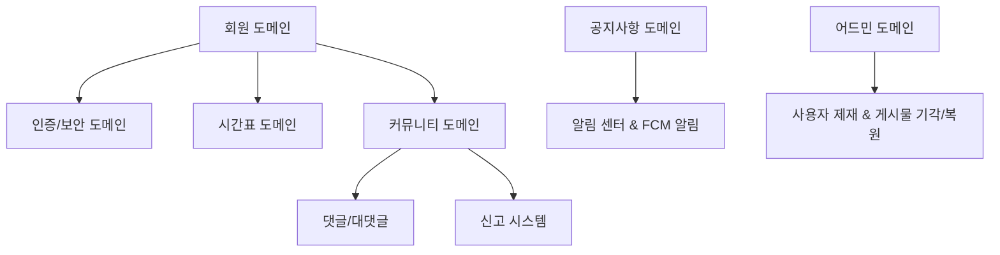

# Y-Sync Service Context

Y-Sync(영남이공대학교 컴퓨터정보과 학사 연동 및 커뮤니티 플랫폼)의 비즈니스 목적, 핵심 도메인 영역, 그리고 타겟 사용자를 정의한 메인 AI 가이드 문서입니다.

---

## 1. 서비스 개요 (Service Overview)
Y-Sync는 영남이공대학교 컴퓨터정보과 학생들의 학업 효율성과 학과 커뮤니티의 소통 증진을 위해 개발된 전용 플랫폼입니다. 
파편화되어 있던 학사 일정, 시간표 설정, 익명 커뮤니티, 공지사항 알림 등을 모바일 및 웹 환경에서 유기적으로 연결하고 통합 관리합니다.

---

## 2. 타겟 사용자 (Target Users)
* **학생 (User)**
  - 실시간으로 학사 일정을 조회하고, 자신의 학기 시간표를 동적으로 구성 및 스크랩합니다.
  - 커뮤니티 게시판을 통해 질문(Q&A), 팀원 모집, 자유 주제로 익명/기명 소통을 나눕니다.
* **학과 관리자 (Admin)**
  - 학사 공지사항 및 학사 일정을 생성하고 관리합니다.
  - 학생들의 신고가 누적된 게시글 및 댓글을 실시간 모니터링(블라인드)하고, 악성 유저를 즉시 차단합니다.
* **총괄 관리자 (Super Admin)**
  - 학과 관리자(Admin) 권한 신청을 검토하고 최종 승인 또는 반려합니다.
  - 사전 등록된 학번 기반의 데이터베이스를 일괄 관리(CSV 등)합니다.

---

## 3. 핵심 비즈니스 도메인 영역 (Core Business Domains)

### 1) 회원 및 인증 (Member & Authentication)
- **학번 기반 사전 등록**: 학과 측에서 사전에 등록한 학번 and 이름을 가진 학생만이 영남이공대 메일(`@ync.ac.kr`) 인증을 통해 최종 가입 및 활성화(isActivated)될 수 있습니다. (외부인 가입 완전 통제)
- **보안 가드**: 가입 완료 유저에 한해 JWT 토큰을 발급하며, 어드민에 의해 정지(isSuspended) 처리된 계정은 토큰이 유효하더라도 즉시 API 요청에서 튕겨나갑니다.

### 2) 학사 일정 및 시간표 (Calendar & Timetable)
- **학사 일정**: 공지사항 및 일정 관리 도구와 연계되어 일 단위/월 단위로 이벤트를 조회합니다.
- **개인 시간표**: 등록된 학과 개설 과목 요일/교시를 기준으로 겹치지 않게 시간표 셀을 개인 맞춤형으로 렌더링하고 스크랩합니다.

### 3) 공지사항 및 푸시 알림 (Notice & FCM Notification)
- **공지사항**: 학과 주요 소식을 전파하며, AI 요약 필드(aiSummary)를 포함하여 모바일 카드 뷰에서 가독성을 높입니다.
- **FCM 푸시**: 새로운 공지사항이 등록되거나 본인 글에 댓글이 작성되었을 때, 활성화된 Member들의 디바이스 토큰(fcmToken)으로 즉시 백그라운드/포그라운드 푸시 알림을 발송합니다.
- **인앱 알림 센터 (Notification Center)**: 수신한 알림 내역을 데이터베이스에 보관하여 앱 내에서 모아볼 수 있는 기능을 제공합니다. 알림을 탭하면 해당하는 공지사항이나 커뮤니티 게시물 상세 화면으로 즉시 이동(딥링크 연동)하며, 전체 읽음 처리 및 개별 삭제를 지원합니다.

### 4) 커뮤니티 및 대댓글 (Community & Nested Comments)
- **익명성 및 카테고리**: 질문, 팀원 모집, 자유 등으로 나누어 작성하며, 익명 여부를 선택할 수 있습니다.
- **자기 참조 대댓글**: 부모-자식 관계가 명확한 계층 트리 구조의 댓글 레이아웃을 통해 토론식 대화를 매끄럽게 지원합니다.

### 5) 신고 및 제재 통제 (Report & Moderation)
- **신고 시스템**: 게시글/댓글에 대해 허위 정보, 비방 등의 사유로 신고를 누적하며, 특정 횟수 이상 누적 시 관리자 블랙리스트에 실시간 집계됩니다.
- **모더레이션**: 어드민은 신고 대상을 강제 블라인드 처리하거나, 허위 신고일 경우 신고 내역을 일괄 클리어(기각) 및 복원합니다. 상습 악성 유저는 실시간 차단 처리합니다.
