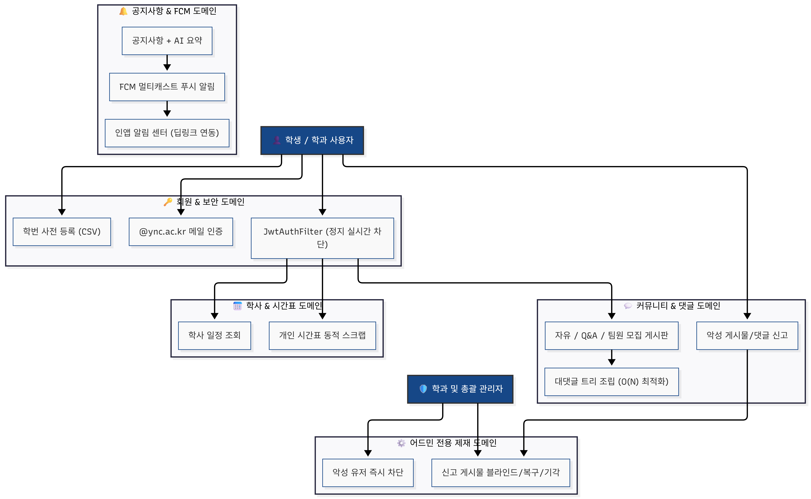
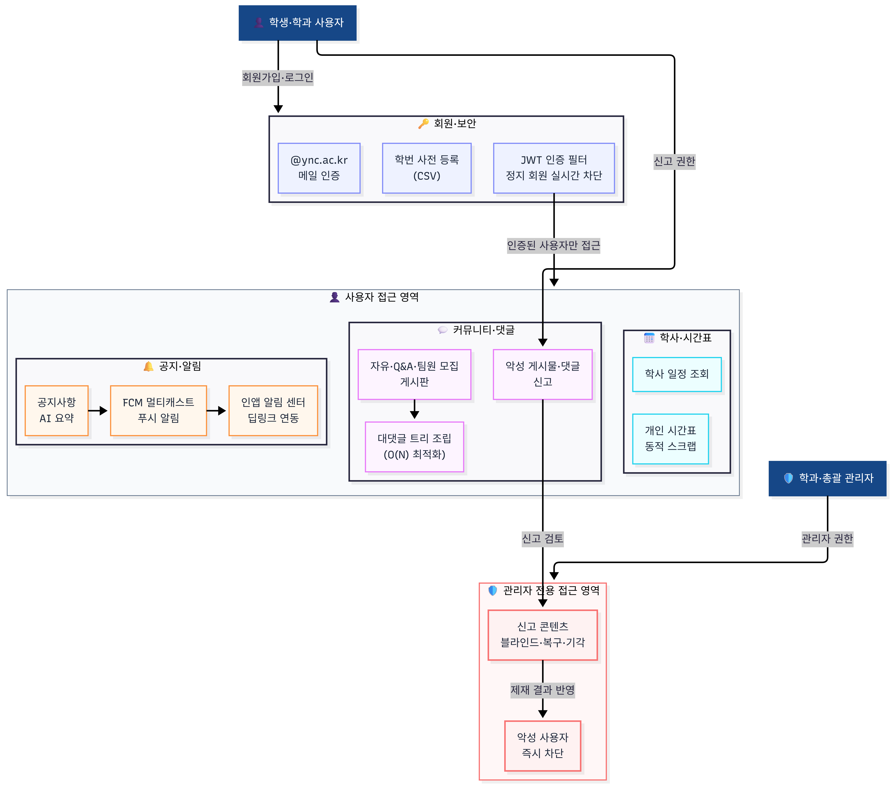
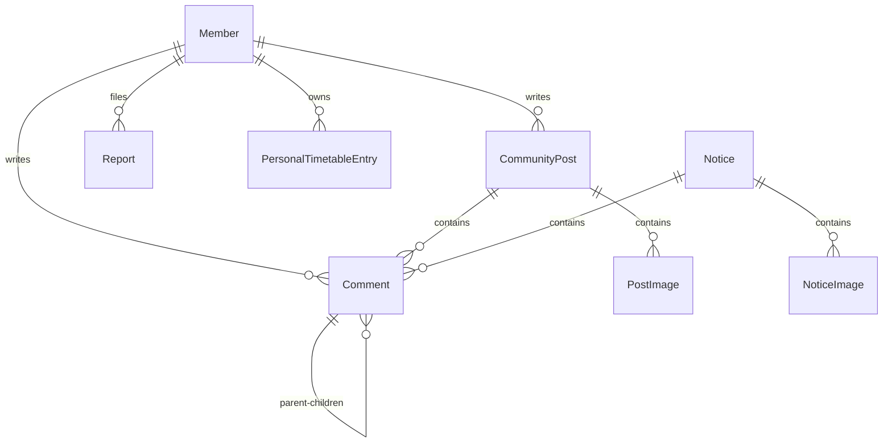

# Y-Sync 서비스 기능과 시스템 아키텍처

이 문서는 Y-Sync가 어떤 서비스인지(서비스 개요, 사용자와 역할, 기능 흐름)와 그것을 떠받치는 기술 구조(기술 스택, 패키지 구조, 데이터 모델, 인프라 배포 스펙)를 함께 담습니다. 서비스 설명을 먼저 읽고 기술 명세로 내려가도록 구성했습니다.

---

## 서비스 개요
Y-Sync는 영남이공대학교 컴퓨터정보과 학생들의 학업 효율성과 학과 커뮤니티의 소통 증진을 위해 개발된 전용 플랫폼입니다. 
파편화되어 있던 학사 일정, 시간표 설정, 익명 커뮤니티, 공지사항 알림 등을 모바일 및 웹 환경에서 유기적으로 연결하고 통합 관리합니다.

---

## 사용자와 역할
* **학생 (User)**
  - 실시간으로 학사 일정을 조회하고, 자신의 학기 시간표를 동적으로 구성 및 스크랩합니다.
  - 커뮤니티 게시판을 통해 질문(Q&A), 팀원 모집, 자유 주제로 익명/기명 소통을 나눕니다.
* **학과 관리자 (Admin)**
  - 학사 공지사항 및 학사 일정을 생성하고 관리합니다.
  - 학생들의 신고가 누적된 게시글 및 댓글을 실시간 모니터링(블라인드)하고, 악성 유저를 즉시 차단합니다.
* **총괄 관리자 (Super Admin)**
  - 학과 관리자(Admin) 권한 신청을 검토하고 최종 승인 또는 반려합니다.
  - 사전 등록된 학번 기반의 데이터베이스를 일괄 관리(CSV 등)합니다.

---

## 서비스 기능과 흐름

### 🌐 1. 전체 시스템 배포 아키텍처 다이어그램 (System Architecture)



---

### 🧩 2. 서비스 비즈니스 도메인 아키텍처 다이어그램 (Domain Architecture)



---

### 🔄 3. 시스템 핵심 인증 & 푸시 알림 시퀀스 다이어그램 (Sequence Diagram)


* **1. 인증 및 정지 회원 차단**: Bearer JWT 검증 ➡️ DB 정지 상태 조회 ➡️ HTTP 403 차단 반환
* **2. 공지사항 저장 및 푸시 알림**: 공지 저장 ➡️ DB 활성 FCM 토큰 조회 ➡️ `loop [토큰 500개 단위]` 멀티캐스트 전송 ➡️ 푸시 전달
* **3. 예외 및 실패 처리**: DB 저장 오류(500) 핸들링 및 FCM 실패 처리(세부 동작은 알림 서비스 구현 참조)


### A. 회원 및 인증 (Member & Authentication)
* **학번 기반 사전 등록 및 인증 가입**:
  1. **학번 사전 등록**: 관리자가 학생 학번과 이름, 기본 USER 역할을 데이터베이스에 사전 등록(단건 혹은 CSV 대량 등록)합니다. 가입 전까지 계정은 `isActivated = false` 상태입니다. (사전 등록된 학생 대상)
  2. **이메일 인증번호 발송**: 학생은 회원가입 화면에서 학번과 이름을 입력하고 인증을 요청합니다. 시스템은 사전 등록 데이터와 일치할 경우 학생이 입력한 영남이공대 웹메일(`@ync.ac.kr`)로 6자리 일회용 인증코드를 발송합니다.
  3. **인증코드 매칭**: 서버는 인증코드를 인메모리 스토리지(`ConcurrentHashMap`)에 5분간 보관하며, 사용자가 맞게 입력하면 10분 동안 회원가입 완료가 가능한 인증 완료 상태를 보관합니다.
  4. **가입 완료 및 활성화**: 최종 가입 폼에서 입력받은 패스워드를 인코딩하여 저장하고 `isActivated = true`로 상태를 변환함으로써 가입 절차가 마무리됩니다.

* **JWT Stateless 인증 및 차단 유저 실시간 격리 가드**:
  ```
  [클라이언트 API 요청 (Bearer JWT)]
                 │
                 ▼
  ┌──────────────────────────────┐
  │  JwtAuthenticationFilter     │
  │  - JWT 서명 및 유효성 검증    │
  │  - DB에서 유저 정지 여부 조회  │
  └──────────────┬───────────────┘
                 │
                 ├─► (isSuspended == true) ──► [즉시 HTTP 403 반환 및 중단]
                 │
                 ▼  (정상 상태)
  ┌──────────────────────────────┐
  │  SecurityContext 인증 등록   │ ──► [컨트롤러로 요청 이관]
  └──────────────────────────────┘
  ```
  - **실시간 정지 제재**: JWT의 특성상 서버에 세션이 없어 실시간 제재가 어렵다는 한계를 극복하기 위해 `JwtAuthenticationFilter`에서 토큰 검증 시점마다 DB의 `isSuspended` 차단 플래그를 실시간 확인합니다.
  - **가드 동작**: 정지된 유저가 요청 시 컨트롤러 단으로 이관되기 전 필터 레벨에서 즉각 **HTTP 403 Forbidden** 응답("차단된 계정입니다. 관리자에게 문의하세요.")을 내보내며 요청을 중단시킵니다.

### B. 학사 일정 및 시간표 (Calendar & Timetable)
* **학사 일정**: 공지사항 및 일정 관리 도구와 연계되어 일 단위/월 단위로 이벤트를 조회합니다. 모바일 월간 달력은 항상 6주 높이를 확보하고 달력 전체를 먼저 배치하여 마지막 주 날짜가 일정 목록에 가려지지 않습니다.
* **학과 시간표**: 관리자가 학년별 공용 수업을 등록하며 학생은 `학과 시간표` 모드에서 학년을 선택해 조회합니다.
* **개인 시간표**: 학생이 `개인 시간표` 모드에서 본인의 수업을 직접 추가·수정·삭제합니다. 데이터는 회원별로 서버에 영구 저장되고 JWT 소유권으로 격리되며, 같은 회원의 요일·교시 중복은 서버에서 차단합니다.

### C. 공지사항 및 푸시 알림 (Notice & FCM Notification)
* **공지사항 요약**: 학과 주요 소식을 전파하며, AI 요약 필드(aiSummary)를 포함하여 모바일 카드 뷰에서 가독성을 높입니다.
* **FCM 푸시**: 새로운 공지사항이 등록되거나 본인 글에 댓글이 작성되었을 때, 활성화된 Member들의 디바이스 토큰(fcmToken)으로 즉시 백그라운드/포그라운드 푸시 알림을 발송합니다.
* **인앱 알림 센터 (Notification Center)**: 수신한 알림 내역과 `isRead` 상태를 데이터베이스에 보관하여 앱 내에서 모아볼 수 있는 기능을 제공합니다. 알림을 탭하면 해당하는 공지사항이나 커뮤니티 게시물 상세 화면으로 즉시 이동(딥링크 연동)하며, 전체 읽음 요청은 실제 갱신 건수(`updatedCount`)를 반환합니다. 프론트엔드는 성공 응답 뒤 목록과 미읽음 배지를 함께 갱신하고, 실패 시 읽음 상태를 낙관적으로 바꾸지 않습니다.

### D. 커뮤니티 및 대댓글 (Community & Nested Comments)
* **익명성 및 카테고리**: 질문, 팀원 모집, 자유 등으로 나누어 작성하며, 익명 여부를 선택할 수 있습니다.
* **목록 카드 UX**: 게시글은 흰색 표면, 얇은 테두리, 카드 간 간격으로 항목 경계를 구분합니다. 이미지가 있으면 본문 우측 상단에 썸네일을 표시하고, 조회·댓글 수와 즐겨찾기는 이미지 유무와 관계없이 카드 하단 전체 너비에서 동일하게 정렬합니다.
* **대댓글 자기참조 계층 트리 조립 ($O(N)$ 최적화)**: 부모-자식 관계가 명확한 계층 트리 구조의 댓글 레이아웃을 제공하기 위해, 쿼리 횟수를 최소화하여 DB 부하를 경감시키는 가공 알고리즘이 탑재되어 있습니다.

  - **동작 방식**: 데이터베이스에는 평탄하게 조회 쿼리를 날리고 메모리 단에서 `Map`을 사용해 단일 루프로 조립함으로써 N+1 문제를 방지하고 성능을 최적화했습니다.

### E. 신고 및 모더레이션 (Report & Moderation)
* **다형성 신고 수집**: `ReportRepository`를 통해 게시물(POST)과 댓글(COMMENT)의 신고 이력을 고유 ID 및 타겟 타입 문자열 형태로 수집합니다.
* **블라인드 (소프트 딜리트)**: 게시글/댓글에 대해 허위 정보, 비방 등의 사유로 신고가 5회 이상 누적되거나 어드민이 강제 블라인드 처리하면 `isDeleted = true` 및 `deletionReason`이 세팅되며, 프론트엔드에서는 취소선 및 숨김 메시지를 띄웁니다.
* **신고 기각 / 복원 (Dismiss)**:
  - 허위 신고의 경우 관리자가 [신고 기각/복구]를 실행하면 백엔드는 해당 대상에 등록된 모든 `Report` 레코드를 DB에서 영구 삭제합니다.
  - 대상이 이미 소프트 딜리트 처리되어 가려졌던 상태였다면 `isDeleted = false`로 원복시킵니다.
  - 복원 대상이 댓글인 경우, 상위 관계에 있는 게시물(Post) 혹은 공지사항(Notice)의 전체 댓글 카운트(`commentCount`) 값을 정상적으로 다시 1 올려주어 정합성을 동기화합니다.

학년 선택·갱신 및 알림 수신 대상 변경은 별도 기획과 구현 상태를 확인합니다. 위 기능 설명만으로 배포 완료 여부를 판단하지 않습니다.

---

## 1. 기술 스택 요약 (Technology Stack)

### 백엔드 (Backend)
* **Framework**: Spring Boot 4.0.3 (Java 21)
* **Security**: Spring Security (JWT Stateless Authentication)
* **Database / ORM**: H2 Database (개발/테스트) / MySQL (프로덕션), Spring Data JPA
* **Build Tool**: Gradle

### 프론트엔드 (Frontend)
* **Framework**: Flutter (Web & Mobile Multi-platform 지원)
* **State Management**: Flutter Riverpod 3.x (Notifier, FutureProvider 기반)
* **Network Client**: Dio (Interceptors를 이용한 JWT 헤더 및 로깅 공통화)
* **Build Tool**: Flutter Web Builder

### API 데이터 계약 경계
* 백엔드는 JPA 엔티티를 외부 응답으로 직접 노출하지 않고 Request/Response DTO를 API 경계로 사용합니다.
* `isRead`, `isPinned`, `isDeleted`, `isAuthorSuspended`와 같은 boolean 필드는 DTO에 `@JsonProperty`를 명시해 Lombok getter 이름과 무관하게 JSON 키를 고정합니다.
* Flutter 모델은 단계적 배포 중 호환성을 위해 공식 `isX` 키를 우선 파싱하고 이전 `x` 키를 fallback으로 처리합니다. 양쪽 계약은 백엔드 Jackson 테스트와 Flutter 모델 테스트로 보호합니다.

---

## 2. 시스템 구조 및 패키지 아키텍처

### A. 백엔드 패키지 폴더 트리 (Spring Boot)
```
y-sync/backend/src/main/java/com/ync/ysync/
├── config/             # Security 설정, JWT 필터 및 유틸
│   ├── SecurityConfig.java
│   ├── JwtAuthenticationFilter.java
│   └── AuthUtil.java
├── controller/         # REST API 컨트롤러 레이어
│   ├── AdminController.java
│   ├── AdminMemberController.java
│   ├── CommentController.java
│   └── CommunityController.java
├── service/            # 비즈니스 로직 처리 레이어
│   ├── MemberService.java
│   ├── CommentService.java
│   ├── PersonalTimetableService.java
│   └── EmailService.java
├── domain/             # JPA 엔티티 레이어
│   ├── Member.java
│   ├── CommunityPost.java
│   ├── Comment.java
│   ├── Report.java
│   ├── PersonalTimetableEntry.java
│   └── Notice.java
└── repository/         # DB Access 인터페이스 레이어 (Spring Data JPA)
    ├── MemberRepository.java
    ├── CommentRepository.java
    ├── CommunityPostRepository.java
    ├── PersonalTimetableEntryRepository.java
    └── ReportRepository.java
```

### B. 프론트엔드 폴더 트리 (Flutter)
```
y-sync/frontend/lib/
├── models/             # API 수신 데이터를 매핑하는 불변 DTO 모델군
│   ├── member.dart
│   ├── comment.dart
│   ├── community_post.dart
│   └── notice.dart
├── providers/          # Riverpod 상태 관리 노티파이어 및 데이터 제공자
│   ├── auth_provider.dart
│   ├── comment_provider.dart
│   ├── community_provider.dart
│   └── admin_provider.dart
├── screens/            # UI 화면 컴포넌트군 (모바일 및 웹 반응형)
│   ├── admin_post_management_screen.dart
│   ├── community_detail_screen.dart
│   ├── notice_detail_screen.dart
│   └── login_screen.dart
├── widgets/            # 재사용성이 높은 디자인 위젯 및 커스텀 다이얼로그
│   ├── deletion_reason_dialog.dart
│   └── image_viewer_screen.dart
└── utils/              # 환경 의존적 추상화 유틸 및 헬퍼
    ├── csv_picker_stub.dart
    ├── csv_picker_web.dart
    └── image_url_helper.dart
```

---

## 3. 데이터 모델 관계 (JPA Entity Relationships)



* **대댓글 (자기 참조)**: `Comment` 엔티티 내에 `@ManyToOne Comment parent` 및 `@OneToMany List<Comment> children` 양방향 관계가 성립되어 계층적 관계를 메모리 맵핑으로 조립합니다.
* **신고 (Report)**: `Report` 엔티티는 `@Enumerated(EnumType.STRING) TargetType targetType` (POST / COMMENT) 및 `Long targetId`를 결합하여 하나의 테이블에서 게시글과 댓글 신고를 다형성 형태로 유연하게 커버합니다.
* **개인 시간표 (PersonalTimetableEntry)**: 회원별 요일·시작/종료 교시와 과목 정보를 저장합니다. 모든 조회와 변경은 JWT에서 확인한 `member_id`로 제한하고, 서비스에서 같은 회원의 교시 중복을 차단합니다.
* **소프트 딜리트 (Soft Delete)**: `CommunityPost` 및 `Comment` 엔티티는 `isDeleted` 플래그 및 `deletionReason` 문자열 필드를 통해 관리자에 의한 물리 삭제 대신 안전한 논리 삭제(블라인드)를 지원합니다.

---

## 4. 데이터베이스 테이블 구조 & 시드 데이터 가이드

### A. 주요 테이블 정보 및 제약조건
* **MEMBER (회원)**
  - `login_id`: 학번(유니크 인덱스). 회원가입 시 사전 등록 여부를 체크하는 기준 값입니다.
  - `is_activated`: 이메일 인증을 완료하여 가입이 승인되었는지 여부 (기본값 `false`).
  - `is_suspended`: 관리자에 의해 서비스 이용이 정지되었는지 여부 (기본값 `false`).
* **COMMUNITY_POST (게시물)**
  - `member_id`: 작성자 연관관계 (Foreign Key).
  - `is_deleted`: 논리 삭제(블라인드) 플래그.
* **COMMENT (댓글 / 자기참조)**
  - `parent_id`: 상위 댓글 식별키 (Self-Referencing FK). 루트 댓글인 경우 `null`.
  - `is_deleted`: 논리 삭제 플래그.
* **REPORT (신고)**
  - `target_type`: `"POST"` 혹은 `"COMMENT"` 문자열.
  - `target_id`: 신고 대상의 PK 식별자.
* **PERSONAL_TIMETABLE_ENTRY (개인 시간표)**
  - `member_id`: 시간표 소유 회원 FK 및 조회 인덱스.
  - `day_of_week`: 월요일부터 금요일까지의 요일 문자열.
  - `start_period`, `end_period`: 1~9교시 범위이며 서비스 계층에서 동일 회원의 시간 중복을 검증합니다.
  - `subject_name`은 필수이며 `professor_name`, `classroom`은 빈 문자열로 저장할 수 있습니다.

### B. 테스트용 사전등록 학번 시드 데이터 (SQL INSERT)
로컬 H2 또는 QA 테스트 서버 구동 시 아래 SQL을 활용하여 테스트용 시드 데이터를 주입할 수 있습니다.
```sql
-- 1. 테스트용 사전등록 학생 데이터 (아직 회원가입 안 한 학생 - 이메일 가입 테스트용)
INSERT INTO member (login_id, name, password, role, provider, auth_type, is_activated, is_suspended, notice_enabled, comment_enabled, created_at)
VALUES 
('20260001', '홍길동', '$2a$10$TEMP_HASH_PASSWORD_STRING_SIGNUP_WAITING', 'USER', 'LOCAL', 'PASSWORD', false, false, true, true, NOW()),
('20260002', '이순신', '$2a$10$TEMP_HASH_PASSWORD_STRING_SIGNUP_WAITING', 'USER', 'LOCAL', 'PASSWORD', false, false, true, true, NOW());

-- 2. 이미 활성화 완료된 일반 사용자 테스트용 계정 (학번: 20268888, 비번: test1234!)
INSERT INTO member (login_id, name, password, role, provider, auth_type, is_activated, is_suspended, notice_enabled, comment_enabled, created_at)
VALUES 
('20268888', '일반테스터', '$2a$10$wK1mYp60c3nSwTj.Dqj7OOFN7Qn2fWwS5QYxZ1X8j.c/0L.e65c52', 'USER', 'LOCAL', 'PASSWORD', true, false, true, true, NOW());

-- 3. 이미 활성화 완료된 학과 관리자 테스트용 계정 (학번: 20269999, 비번: admin1234!)
INSERT INTO member (login_id, name, password, role, provider, auth_type, is_activated, is_suspended, notice_enabled, comment_enabled, created_at)
VALUES 
('20269999', '학과관리자', '$2a$10$H8z/8iC/6pL.2wSw9k9oOOFN7Qn2fWwS5QYxZ1X8j.c/0L.e65c52', 'ADMIN', 'LOCAL', 'PASSWORD', true, false, true, true, NOW());

-- 4. 차단(정지) 계정 테스트용 데이터 (학번: 20267777, 비번: test1234!)
INSERT INTO member (login_id, name, password, role, provider, auth_type, is_activated, is_suspended, notice_enabled, comment_enabled, created_at)
VALUES 
('20267777', '악성사용자', '$2a$10$wK1mYp60c3nSwTj.Dqj7OOFN7Qn2fWwS5QYxZ1X8j.c/0L.e65c52', 'USER', 'LOCAL', 'PASSWORD', true, true, true, true, NOW());
```

### C. 로컬 개발 환경에서 시드 데이터 주입 및 테스트 실행 방법
* **H2 Database Console 사용 (로컬 H2 환경)**: 
  - 백엔드 가동 후 `http://localhost:8080/h2-console` 접속.
  - JDBC URL에 `jdbc:h2:mem:ysync_db` 입력 후 Connect하여 위의 SQL 쿼리셋을 실행.
* **로컬 MySQL Docker 환경**:
  ```bash
  # MySQL 컨테이너 내부로 직접 진입하여 주입
  docker exec -it ysync-mysql mysql -u root -p ysync_db
  # (비밀번호 1234 입력 후 SQL 문 실행)
  ```

---

## 5. 서버 인프라 및 배포 아키텍처 (Production Infrastructure)

Y-Sync 백엔드는 리눅스 VM(Oracle Cloud 1GB RAM 프리티어 환경 맞춤) 상에서 **Docker Compose**를 통해 애플리케이션과 운영 인프라를 포함한 4개의 컨테이너로 동작합니다.

```

운영 배포는 `main` 브랜치 push를 트리거로 GitHub Actions의 `Production Deploy` 워크플로가 수행합니다. 변경 파일을 기준으로 백엔드와 프론트엔드를 분리 빌드하고, `production` Environment 승인 후 백엔드는 SSH로 Oracle VM에 배포하며 프론트엔드는 Firebase Hosting에 배포합니다. 기능 브랜치에서 `develop`으로 가는 PR은 `CI` 워크플로에서 백엔드 테스트/JAR 빌드, Flutter 분석/테스트/Web 빌드, Docker Compose 설정 검사를 통과해야 합니다. Firebase Hosting은 `index.html`과 Flutter 서비스 워커를 저장하지 않고 항상 재검증하며, `main.dart.js`와 부트스트랩 파일은 ETag 조건부 재검증을 사용해 PWA 업데이트 지연과 불필요한 전체 다운로드를 함께 줄입니다.
                  [외부 인터넷 클라이언트]
                             │
                      80/443 (HTTP/S)
                             ▼
                    ┌─────────────────┐
                    │   ysync-nginx   │ ◄───► [ysync-certbot] (SSL 갱신)
                    └────────┬────────┘
                             │
                       Docker Bridge
                             ▼
                    ┌─────────────────┐
                    │  ysync-backend  │
                    └────────┬────────┘
                             │
                       Docker Bridge
                             ▼
                    ┌─────────────────┐
                    │   ysync-mysql   │ (RAM 350M 제한)
                    └─────────────────┘
```

### A. 초경량 메모리 최적화
1GB 저사양 RAM VM 환경에서 커널 OOM(Out of Memory)으로 인해 서버가 강제 종료되는 현상을 방지하기 위해 다음 튜닝을 고정 적용했습니다.
* MySQL 성능 스키마 비활성화 (`performance_schema=OFF` 추가)
* InnoDB 버퍼 풀 64MB 제한
* Docker 컨테이너 레벨 메모리 한계 제한 (`MySQL`: 최대 350MB, `Backend`: 최대 450MB 한정 제어)

### B. Nginx Reverse Proxy & SSL 세부 설정
* 전방 프록시 Nginx(`docker/nginx/default.conf`)가 외부 80/443 통신을 통합 처리합니다.
* **도메인 호스트**: `168-107-29-144.sslip.io`
* **HTTP (80)**: ACME 챌린지 경로(`/.well-known/acme-challenge/`) 서빙을 제외한 모든 요청을 HTTPS(443)로 강제 리다이렉트(`301 Redirect`).
* **HTTPS (443)**: Certbot 컨테이너가 발급한 SSL pem 파일들을 로드하여 보안 서빙을 제공하며, 미디어 전송을 위해 `client_max_body_size 50M`을 세팅했습니다.

### C. LetsEncrypt SSL 인증서 자동 갱신
* `ysync-certbot` 컨테이너가 12시간 주기(`sleep 12h`)로 `certbot renew` 백그라운드 루프 명령을 가동합니다.
* Nginx와 Certbot 컨테이너 간 볼륨 공유를 통해 무중단 인증서 파일 자동 갱신 구조를 취하고 있습니다.

### D. 파일 저장소 단계적 분리

* `STORAGE_PROVIDER=local|s3` 설정으로 파일 저장 구현체를 전환합니다. 기본값은 기존 로컬 볼륨입니다.
* S3 운영 버킷은 서울 리전의 비공개 `y-sync-attachments-155641294529`을 사용하고, 애플리케이션 IAM 사용자는 해당 버킷의 `uploads/*`에만 접근합니다.
* 신규 S3 객체의 DB 경로는 `/s3-uploads/{uuid}` 형식을 유지합니다. 백엔드는 요청마다 5분짜리 Presigned URL을 생성해 `302`로 리다이렉트하므로 버킷을 공개하지 않습니다.
* 커뮤니티와 공지는 이미지뿐 아니라 PDF, HWP/HWPX, Office 문서, TXT, ZIP 첨부를 공통 지원합니다. 파일당 20MB, 게시물당 10개·총 50MB로 제한하며 실행 파일 확장자는 거부합니다.
* API는 범용 `attachments` 메타데이터를 제공하고 기존 `imageUrls` 필드는 이미지 미리보기 및 구버전 클라이언트 호환을 위해 유지합니다.
* 일반 파일 다운로드에는 원본 파일명을 `Content-Disposition`에 포함한 짧은 Presigned URL을 사용합니다.
* 기존 `/uploads/{uuid}` 데이터와 로컬 볼륨은 그대로 제공해 파일 일괄 이전 없이 저장소를 단계적으로 전환할 수 있습니다.

### E. PWA 서버 가용성 감지와 점검 화면

* Flutter 앱 셸의 `ServerAvailabilityGate`가 기존 Navigator와 화면 상태를 유지하면서 서버 장애 시 점검 화면을 최상단에 표시합니다.
* 공용 Dio 인터셉터는 연결·송수신 타임아웃, 연결 오류, HTTP `502`·`503`·`504`를 서버 이용 불가 상태로 분류합니다. 인증 실패 `401`과 일반 비즈니스 오류는 점검 상태로 전환하지 않습니다.
* 앱 시작과 PWA가 포그라운드로 복귀할 때 공개 상태 확인 API인 `GET /api/v1/hello`를 호출합니다. 장애 화면이 표시된 동안에는 별도 Dio 클라이언트가 5초 타임아웃으로 10초마다 같은 API를 확인합니다.
* 서버가 정상 응답하면 가용 상태를 복원하고 점검 화면만 제거하므로 사용자는 장애 전에 보던 화면으로 돌아갑니다. 사용자는 `지금 다시 확인` 버튼으로 즉시 재시도할 수도 있습니다.
* 브라우저가 백그라운드 PWA의 타이머를 지연하거나 프로세스를 종료할 수 있으므로 10초 간격은 백그라운드 실행을 보장하지 않습니다. 복귀 시 즉시 확인과 다음 실행 시 초기 확인으로 이를 보완합니다.
